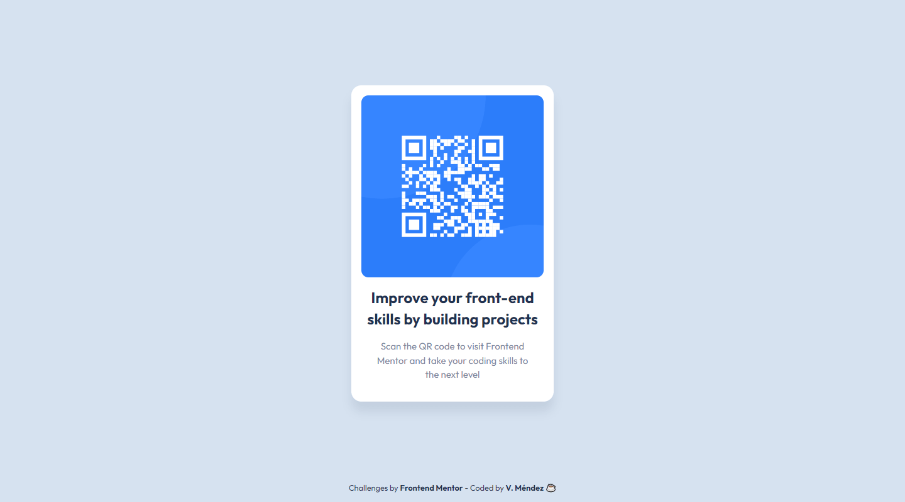

<!-- 10 July 2022 -->
# Frontend Mentor - QR code component solution

Hi everyone 👋

This is a solution to the [QR code component challenge on Frontend Mentor](https://www.frontendmentor.io/challenges/qr-code-component-iux_sIO_H). Frontend Mentor challenges help you improve your coding skills by building realistic projects. 

## Table of contents

- [Overview](#overview)
  - [Screenshot](#screenshot)
  - [Links](#links)
- [My process](#my-process)
  - [Built with](#built-with)
- [Author](#author)

## Overview

### Screenshot

- Mobile

- Desktop

### Links

- [Live site URL here](https://irismendez.github.io/qr-code-component/) 👀

## My process

### Built with

- Semantic HTML5 markup
- CSS custom properties
- CSS Grid
- Mobile-first workflow

## Author

- Frontend Mentor - [@irismendez](https://www.frontendmentor.io/profile/irismendez)
- DevChallenges - [@irismendez](https://devchallenges.io/portfolio/irismendez)
- Twitter - [@irismendez_](https://twitter.com/irismendez_)